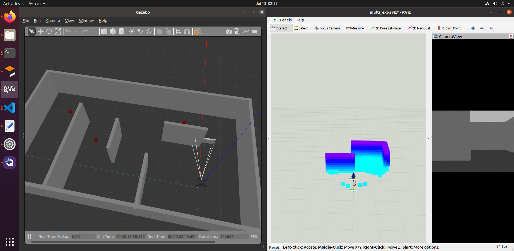

# UAV Maze Solution
The is a UAV maze solution reference utilizing Fast UAV ExpLoration [FUEL](https://github.com/HKUST-Aerial-Robotics/FUEL). To explore using a LiDar and a camera to detect exits. The shortest exit will be identified and the drone will travel toward the shortest exit.

    

# Setup
This has been tested on Ubuntu 20.04 and ROS (noetic).

1. Create catkin workspace

        mkdir ~/catkin_maze_solution/src
        cd ~/catkin_maze_solution/src

2. Dependencies
    - SSLE
    
    Adapted from FUEL with Gazebo and PX4 support. Additionaly, this fork includes maze related logic. Follow the readme instructions to install all FUEL & SSLE dependencies.
        
            git clone https://github.com/luayalshawi/SSLE.git
    
    - Gazebo Plugins

    For realsense sensors and lidar Gazebo plugins, in your workspace, run:

        git clone https://github.com/SeanZsya/gazebo_pulgins
3. Clone this repository inside ~/catkin_maze_solution/src

        https://github.com/luayalshawi/maze_solution.git
4. Build

        catkin_make

5. Source the enviroment. Refer to SSLE readme file for sourcing Gazebo & PX4

# Run the challenge
    roslaunch maze_solution multi_exp_sim_sslidar.launch
    
Then the drone will takeoff and enter the offboard mode. Use the `2d Nav Goal` in Rviz to trigger the maze exploration.

# Issues  
In case of unexpected crash in the exploration refer to this as it may be related to nlopt. [Unexpected crash](https://github.com/HKUST-Aerial-Robotics/FUEL#unexpected-crash)